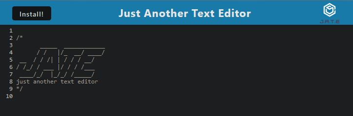

#  Text_Editor_PWA

## Description

This text editor was made following PWA criteria while using IndexedDB to store and retrieve the text data.

## Installation

Run the command ```npm i``` in the terminal.

Run the command ```npm run build``` to create the dist file.

## Usage

Run ```npm start``` in terminal.

Use developer tools to see text you entered be saved in IndexedDB when the application loses focus. Press the install button to install the app.



## License

N/A

## Notes

Unit 19 Mini-Project used as a reference